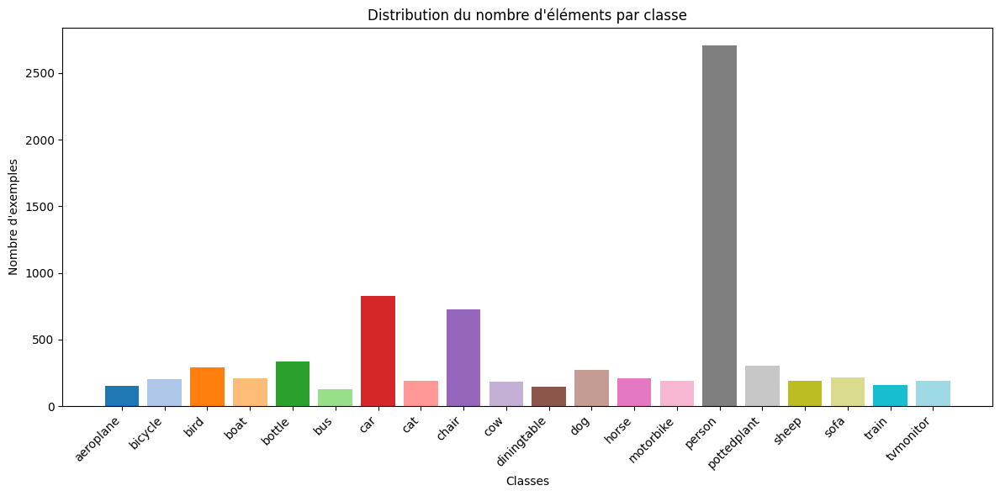

# **Implémentation de YOLOV1 sur PyTorch**
Deux versions de YOLOV1 sont disponibles dans le notebook:
  - L'originale avec une légère modification sur la tête du modèle
  - Version modifiée

## **Architecture**
Modified YOLOV1:
  -  Backbone: EfficientNetV2S (pré-entraîné sur ImageNet)
  -  YOLOV1 Head

## **Résultats**
Le modèle a été entraîné sur des images de taille 224x224 sur 135 itérations (pour plus de détails, voir le code). L'augmentation a quadruplé la base et les résultats sont obtenus avec la méthode Non-Maximum-Suppression (NMS):
  - Seuil de fiabilité/confiance = 0.5
  - Seuil IoU entre cadres englobants prédits = 0.2 (Parcourir le reste du tri, supprimer ceux dont la valeur IoU avec le "meilleur" cadre est égale ou supérieur à un seuil définit)

mAP = mAP50

DA = Data Augmentation
|Version                               | Train mAP (%)| Validation mAP (%)| Test mAP (%)| Epoch Checkpoint| Num Parameters |
|:---:                                 |:---:         |:---:              |:---:        |:---:            |:---:           |
|YOLOV1 DA                             |0.245         |0.261              |0.171        |108              |133 304 702     |
|Modified YOLOV1                       |14.95         |4.15               |3.53         |108              |36 611 854      |
|Modified YOLOV1 DA                    |21.39         |13.13              |13.13        |93               |36 611 854      |

Les mauvais résultats de YOLOV1 DA est principalement dû au non-pré-entraînement des poids du modèle sur un base de données de classification comme ImageNet. Alors que Modified YOLOV1 utilise comme backbone EfficientNetV2S pré-entraîné.

## **Matrice de Confusion**

### **Validation**
<table>
  <tr>
    <td align="center">
      <figure>
        
        <figcaption style="font-family: Arial, sans-serif; font-size: 2px; font-weight: bold;">M_YOLOV1 Validation</figcaption>
      </figure>
    </td>
    <td align="center">
      <figure>
        
        <figcaption style="font-family: Arial, sans-serif; font-size: 2px; font-weight: bold;">M_YOLOV1 DA Validation</figcaption>
      </figure>
    </td>
  </tr>
</table>

### **Test**
<table>
  <tr>
    <td align="center">
      <figure>
        
        <figcaption style="font-family: Arial, sans-serif; font-size: 2px; font-weight: bold;">M_YOLOV1 Test</figcaption>
      </figure>
    </td>
    <td align="center">
      <figure>
        
        <figcaption style="font-family: Arial, sans-serif; font-size: 2px; font-weight: bold;">M_YOLOV1 DA Test</figcaption>
      </figure>
    </td>
  </tr>
</table>

## **Statistiques sur la base de données (VOC2007)**
Les statistiques sur le dataset, nous permettre de prendre des décisions, comme par exemple:
  - utiliser de la data augmentation
  - équilibrer les classes
  - choisir les seuils de confiance et de redondance

  

  

  

