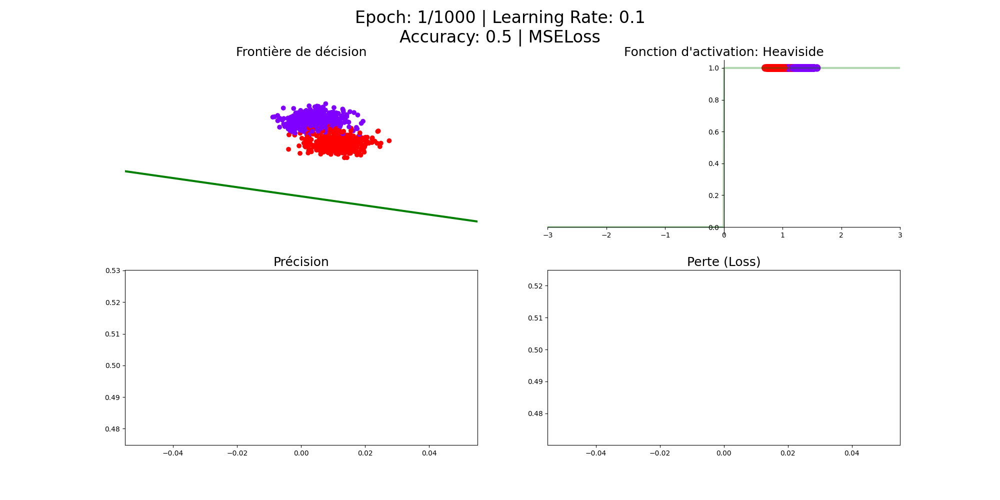
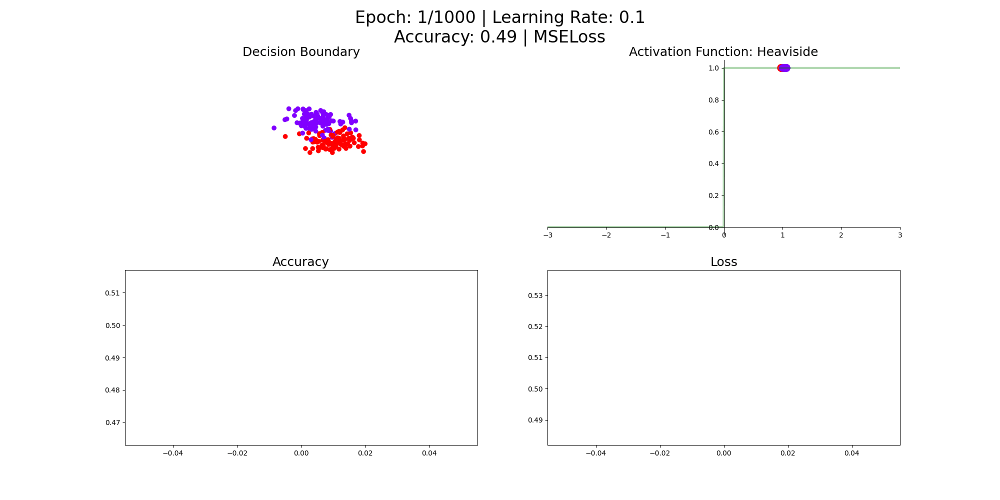

# Perceptron
***
Ce projet implémente le modèle du perceptron en python et explicite, à travers un [pdf](./Documentation/Perceptron.pdf) et des gifs, le fonctionnement du perceptron. Le perceptron, inventée en 1957 par Frank Rosenblatt, est un neurone formel associé à une méthode d’apprentissage supervisé. Le neurone formel, parfois nommé neurone de McCulloch-Pitts, développé par ces derniers en 1943, est une représentation mathématique et informatique d’un neurone biologique. Le perceptron est qualifiée de méthode d’apprentissage supervisé, en raison de l’utilisation d’une base de données annotée (X,Y), c’est-à-dire que chaque exemple de cette dernière est clairement identifié par l’intermédiaire d’une classe (numérotation, dénomination). Contrairement à l’apprentissage non supervisé où seules les données font partie de la base.

    

## Sigmoïde - LogLoss
### Training

    

### Validation

    

## TanH - MSELoss
### Training

    

### Validation

    

## Heaviside - MSELoss
La fonction Heaviside est inutilisable en associant un neurone formel avec la descente de gradient, car sa dérivée est nulle.
### Training

    

### Validation

    

