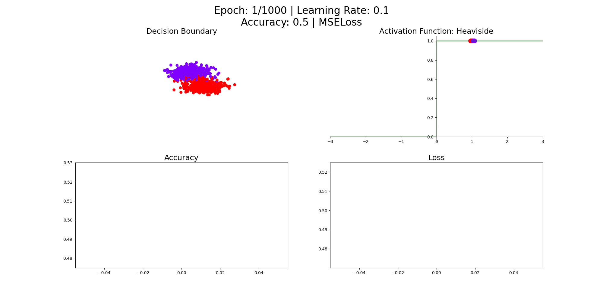

# Perceptron
***
Ce projet implémente le modèle du perceptron en python et explicite, à travers un [pdf](./Documentation/Perceptron.pdf) et des gifs, le fonctionnement du perceptron.

    

## Sigmoïde - LogLoss
### Training

    

### Validation

    

## TanH - MSELoss
### Training

    

### Validation

    

## Heaviside - MSELoss
La fonction Heaviside est inutilisable en associant un neurone formel avec la descente de gradient.
### Training

    

### Validation

    

