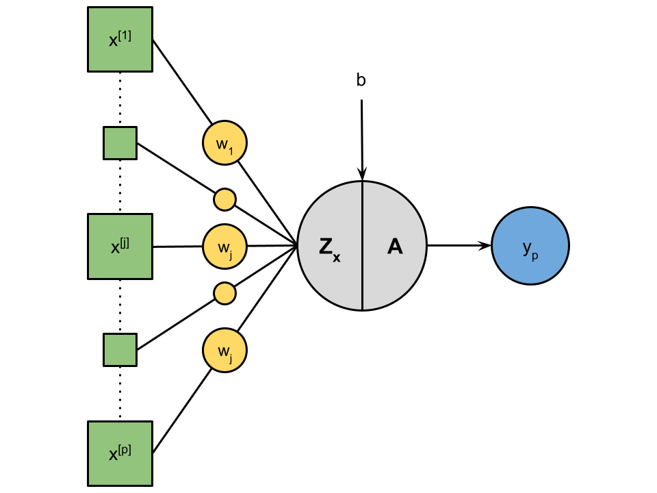

# Perceptron
***
Ce projet implémente le modèle du perceptron en python et explicite à travers un [pdf](./Documentation/Perceptron.pdf) et des gifs sur le fonctionnement du perceptron.

Dans le contexte du perceptron, notre base de données est constitué de n exemples, dont chaque exemple possède p caractéristiques. Ainsi, nous pouvons écrire (X,Y) $\in$ $\mathbb{M}**_{n,p}(\mathbb{R}) \times \mathbb{M}_{n,1}(\mathbb{R})$, avec n, p $\in$ $\mathbb{N}^{*}$.
Les lignes de X représentent les exemples, et les colonnes représentent les caractéristiques:
$$ X =
\begin{pmatrix}
    x_{1}^{[1]} & \cdots  \cdots & x_{1}^{[j]} & \cdots  \cdots & x_{1}^{[p]} \\
    \vdots & \ddots & \vdots & \cdots & \vdots \\
    x_{i}^{[1]} & \cdots  \cdots & x_{i}^{[j]} & \cdots  \cdots & x_{i}^{[p]} \\
    \vdots & \cdots & \vdots & \ddots & \vdots \\
    x_{n}^{[1]} & \cdots  \cdots & x_{n}^{[j]} & \cdots  \cdots & x_{n}^{[p]} \\
\end{pmatrix},
Y = 
\begin{pmatrix}
    y_{1} \\
    \vdots \\
    y_{i} \\
    \vdots \\
    y_{n}
\end{pmatrix}
$$

Chaque donnée en entrée est associée à un \textbf{poids} (noté $w_{j}$, $\forall$ j $\in$ [|1;p|]). Il s'agit d'une somme pondérée des $x_{j}$ auquel nous ajoutons un \textbf{biais} noté b. Maintenant, nous pouvons voir cela comme un modèle linéaire.\\\\
$\forall$ x $\in$ X (x $\in$ $\mathbb{M}_{1,p}$), vecteur ligne de X, un exemple de la base de données.
\[Z_{x}:\left\{
    \begin{array}{rcl}
        \mathbb{M}_{p,1}(\mathbb{R}) \times \mathbb{R} & \longrightarrow & \mathbb{R} \\
        (W,b) & \longmapsto & x \cdot W + b
    \end{array}
\right\}
\]
\[Z_{x}(W,b) = x \cdot W + b =
\begin{pmatrix}
    x^{[1]} \cdots x^{[p]}
\end{pmatrix}
\begin{pmatrix}
    w_{1} \\
    \vdots \\
    w_{p}
\end{pmatrix} + b
\]
\[ Z_{x}(W,b) =  (\sum_{j=1}^{p}w_{j}x^{[j]}) + b \]

Nous appliquons ensuite à la sortie de la fonction $Z_{x}$, une \textbf{fonction d'activation}, notée A.
\[A:\left\{
    \begin{array}{rcl}
        A(z) & \longmapsto & A(z) = y_{p}
    \end{array}
\right\}
\]

.gif)

**The Cauchy-Schwarz Inequality**
$$\left( \sum_{k=1}^n a_k b_k \right)^2 \leq \left( \sum_{k=1}^n a_k^2 \right) \left( \sum_{k=1}^n b_k^2 \right)$$
